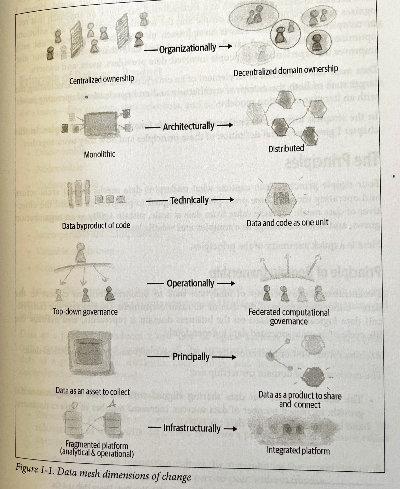

# Data Mesh

Data Mesh is a paradigm that provides a set of principles to change the architectural and organizational approaches to analytical data. Analytical data is a crucial asset to diagnose running businesses and augment them with ML models. 
To shift from a gut-driven business to a culture of data curiosity and valid experimentation.

There are a bunch of different personas that are included in the data work <ToDo - classify them by tech skills and needs>:
* **Analytical data users** such as data scientists and analysts
* **Data Providers** application teams or data engineers
* **Infrastructure engineers or owners** 
* **Data governance teams**
* **Data Leaders or managers**

## The Shifts

## The four principles of Data Mesh
### Principle of Domain Ownership
Decentralize the ownership of analytical data to business domains closest to the data - either the source or its main consumer.

* Allows scalability - avoiding bottleneck of centralized data teams
* Allows continuous change
* Enabling agility by avoiding dependencies across teams
* Increasing business truthfulness - people that fetch and work with the data are together - increases the domain knowledge of the team working with it
* Increases resiliency of analytics and ML
### Principle of Data as a product
With this principle in place it is possible to share data as a product with data users that may come out of the domain.

* Discoverable
* Addresable
* Understandable
* Trustworthy und truthful
* Accessible
* Interoperable
* Valuable on its own
* Secure
###Principle of the selve serve Data Platform
The main purpose of the Selve-serve Data Platform is to empower domains cross-functional teams to share data products

* it reduces the cost of decentralized data ownership
* reduces the complexity of managing end-to-end lifecycles of data products
* Mobilize a larger population of developers
* Enforces the automation of governance policies
### Principle of Federated Computational Governance
* Countering the undesirable consequences of domain-oriented decentralizations - enforces that data can be connected and is understandable
* Allows to build-in cross-cutting governance such as security, privacy, legal, compliance, etc
* Reducing the overhead of synchronization of governance teams with the data producers
* All governance policies should be based on the fact, that the data is about to change. The policies should not try to keep everything constant but needs to embrace change in all aspects
#### Computational Governance
##### Standards as code
* Data discovery - APIs that expose the discoverability information, documentation, schema and SLOs
* Data interfaces - APIs that expose the data
* Data and query modeling - Modeling of semantics and query language
* Lineage
* Polysemes identification modeling - Modeling of identity and systems that globally identify and address common business concepts across the mesh 
##### Policies as code
* Data privacy and protection
* Data localization
* Data Access Control and audit
* Data consent
* Data sovereignty - Preserving the ownership and its control
* Data retention
##### Automated Tests
CI/CD on data to identify drifts in the assured quality - schema checks, i.e.
##### Monitoring
System that is capable of fetching the SLOs of data and identify drifts in quality - fetch the meta info and see if this has changed in any means
 
  

### The Data
There are two classes of data that should be distinguished:
* **Operational data** - supports to running the data. It sits in production relevant OLTP systems and is processed in real-time. It is used for microservices to run the business and captures it state in the moment
* ** Analytical data** - is the historical, integrated and aggregate view of data created as a byproduct of running business. It sits in OLAP systems.

It is important to distinguish this two sources of data and the **data mesh** is dedicated to the analytical data.
## Principal of Domain Ownership

There are three fuzzy classes of domain data
* **source aligned domain data** - Analytical data reflecting the business facts generated by the base systems
* **aggregates** analytical data in the middle between producer and consumer
* **consumer aligned** analytical data , designed for a particular data consumption scenario

## Principle as data as a product
Data mesh shifts the responsibility to provide data with quality and integrity closer to the source to allow scalability and avoid a bottleneck scenario with a centralized data team.
Good products can be characterized by three different measures:
### Usable
#### Discoverable
This is the very first step. If a product can't be discovered it can't be used. In data mesh every dataset provides a standardized set of meta information to allow the automatic registration in a central registry.
#### Addressable
A data product offers a permanent and unique address to allow the user or system to access it. 
It must allow the following points:
* Semantic and syntax changes - schema changes
* Continuous release of new data over time
* Newly supported modes of access
* changing runtime behavioral information
An (addressable aggregate root)[https://martinfowler.com/bliki/DDD_Aggregate.html] serves as an entry to all information about a data product - this idea is also taken from the DDD world.
#### Understandable
A data user must be able to understand the meaning, what kind of entities are described, how they are correlated with each other and if there are adjacent data products.
Computational notebooks can be valid companions to better understand the data fast.

#### Trustworthy ans truthful

### Valuable
