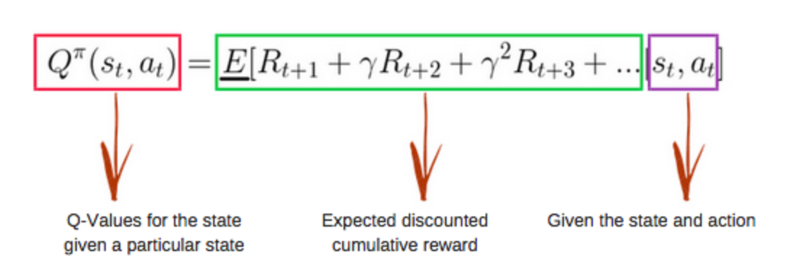
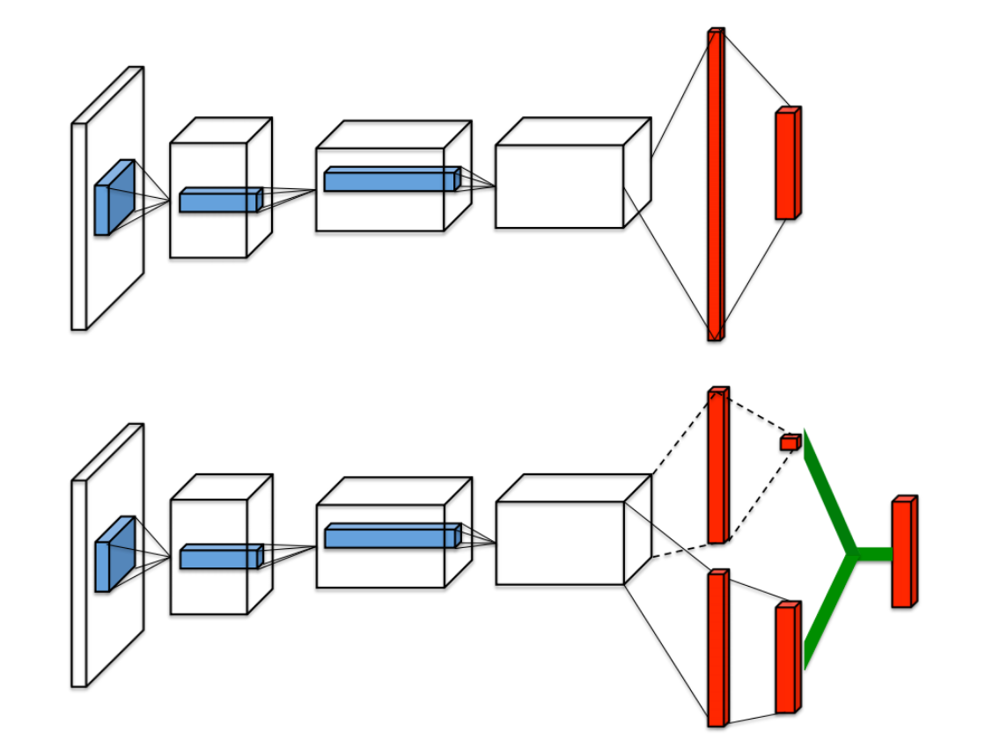

# Deep Reinforcement Learning Hands-On - Maxim lapan

## Chapter 1 - What is reinforcement Learning?
RL is a third category of ML methods. It lays in the middle of supervised and unsupervised methods. By "palying" an environment and monitoring the given reward, which is often defined through a ploicy - it is able to generate the "labeled data" itself.
As chapter 4 shows with an catpole envorinment - by feeding a neural network with the observations of "winning" episodes - RL is able to play cartpole without any implementaion/explanation of the environment!

### Reward
It is just a scalar value , which can be positive or negative. The purpose is to tell the agent how well they have behaved

### Agent
Somebody who interacts with the environment - like the piece of software which plays the game or trades, or....

### Environment
Everything outside the agent - like the chess game or the stock market

### Actions
THings that the agent can do in an environment - like the chess rules or laws that define how stocks can be traded

### Observations
Observations are next to the rewards the second channel of information that the environments provides the agent.

### Discount Factor
The fact that the discount rate is bounded to be smaller than 1 is a mathematical trick to make an infinite sum finite. This helps proving the convergence of certain algorithms. This is relevant for the vsalue iteration method. Without it we would had to deal with an infinite sum of values delivered by certain actions.

### Markov

## Chapter 2 - OpenAI Gym
[Gym](https://www.openai.com) is a framework that implements all necessary parts of RL-Learning (see above). It provides hundreds of already prepared environments - from borad games over algorithmic challenges to parameter tuning and doom. 

## Chapter 3 - Deep Learning with PyTorch
Deep Learning Libraries can be discriminated into two categories:
 * **static graph** - the graph of the NN needs to be compeletedly defined before the calculation. This offers advantages for the library to optimize the calculation - means it is often faster - but it limits the possibilities to work with the network. Tensorflow is using this method.
 * **dynamic graph** - it is not necessary to define the graph in advance exactly. This allows the freedom to perform any tranformations on the actual data. This is also called ** notebook gradients **. PyTorch implements this method.

### TensorBoard 
Nice web based framework to monitor the progress of the NN training. Via [OSS](https://github.com/lanpa/tensorboard-pytorch) libraries also usable for PyTorch.
### Example
**GAN on Atari images** - The chapter results in an example which implements an generative adversarial network which __generates__ Atari images and on the other hand __dicriminates__ if this images are fake or real.
## Chapter 4 - The Cross-Entropy Method
1. Play N-Numbers of epsodes.
2. Calculate the total reward of ewach episode.
3. Chooce the episodes with the highest reward (> the some percentile)
4. Train on the winning episodes
5. Repeat from step one.

__Limitations of cross entropy - shown with the noisy frozenlake environment__ 
* the training episodes have to be finite
* the total reward need to have enough variability
* no intermediate indication if the agent has succeeded or failed

## Chapter 5 - Tabular Learning and the Bellman Equation
### Bellman Equation:

    Principle of Optimality: An optimal policy has the property that whatever the initial state and initial decision are, the remaining decisions must constitute an optimal policy with regard to the state resulting from the first decision. (See Bellman, 1957, Chap. III.3.)

The optimal value of the state is equal to the action, which gives us the max possible expected immediate reward, plus discounted long-term reward for the next state.

### Value of action
Many reinforcement learning introduce the notion of `value-function` which often denoted as V(s) . The value function represent how good is a state for an agent to be in. It is equal to expected total reward for an agent starting from state s. The value function depends on the policy by which the agent picks actions to perform.

### Q - The value of action and the "Value iteration method in action".

Basically Q equals the total reward we can get by executing action a in state s and can be defined via Vs. In practice this is implemented by a lookup table where we calculate the maximum expected future rewards for action at each state by using the Bellman equation:

It can be derived from the `value function`.
An implementation of the FrozenLake environment is provided [here](https://github.com/raven-rwho/Deep-Reinforcement-Learning-Hands-On/blob/master/Chapter05/01_frozenlake_v_iteration.py)
This solution is much more more efficient to solve the FrozenLake env than cross-entropy (seconds to achive 80% success vs hours to achieve 60&). The reasons for this are that cross-entropy needs longer episodes to "understand" what is the difference from elite to problematic ones. But the __major__ difference is that value iteration doesn't need full episodes to start learning. 

### Q-LEarning 
[This is the implemantion of Forzenlake via Q-Learning](https://github.com/raven-rwho/Deep-Reinforcement-Learning-Hands-On/blob/master/Chapter05/02_frozenlake_q_iteration.py). The difference to the value iteration implementation is pretty minor. We keep track in our lookup table of the values of the Q-function instead of just a state. By this we can remove __calc_action_value__ function, because we store the values already in the table. In summary both methods perform pretty much in the same way but the memory print of the Q-Learning table is 4 times bigger.

# Chapter 6 - Deep Q-Networks

This chapter will use Atari 2600 games to showcase far more complex environments, compared to 8x8 grid. If we would try to solve such an env with value iteration we would need to check 210*160 pixels in 128 colors, which equals 128^33600 -> which would need billions of years even on the fastest computer and the value iteration method would try to check all possibilites, even if they will never occur in the game.

1. Initialize `Q(s,a)`with some initial approximation
2. By interacting with the env, obtain the tuple `(s,a,r,s')`
3. Calculate Loss `L=(Qs,a-r)^2` if episode has ended or use Bellman Eq otherwise
4. Update `Q(s,a)` using the __stochastic gradient descent (SGD)__ algorithm, by minimizing the loss with respect to the model parameters
5. Repeat from step 2. as until converged

Due to the __ecploration vs. exploitation__ (how should we react on the env - in case of Pong random doesn't make to much sense) dilemma - the algo doesn't work to well and needs to be tweaked. One way to deal with this is __epsilon-greedy__ which means it starts with 100% random actions and decreases them over the course of training to a small epsilon, like 5% or 2%.
## The Markov property 
Observation from the env is all that we need to act optimally - which is unfortunately in many environments not true - i.e. if we just have one frame of pong, we have no idea about the speed of the ball. This area is called __partially observable Markov Decision Process (POMDPD)__ and one way to handle it is to keep a stack of the `N`last frames.

# Chapter 7 - DQN extensions
## The PyTorch Agent Net Library
This is a higher level library which covers the core functionalities of DQN and can be found [here](https://github.com/Shuma/ptan). It makes the implemention of a DQN algorithm much more conscise. All following examples are using this lib.

__Implementations are provided for all extensions.__

## N-Step DQN
Basically a method to unravel some of the recursion steps for the Ballman Eq
## Double DQN
Basic DQN has a tendency to overestimate values for Q. This can be fixed by taking actions from for the next action from the trained net but take values from Q from the target net.
## Noisy Networks
Instead of adding random actions by the decreasing value of epsilon - add noise to the weights of the full connected layers and learn spead this noise via backpropagation
## Prioritized replay buffer
"Train more on data that surprises you" - instead of storing frames in a buffer - where most frames will be highly correlated and pick random distributed - assign priorities to buffer samples according to training loss. The magic here lies in keeping the balance between training on "unusual" and "normal" behaviour to not loose i.i.d. 
## Dueling DQN

This extension adresses is adding an "advantage" to decisions for the agent by adding two "dueling" layers to the architecture. The advantage is a delta which shows us how much extra reward some actions from the state brings us. It can be positive or negative.
## Categorial DQN (C51)
This is the idea to replace the plain numbers for the values of actions with distributions. There is a nice example of commuting either by car or by train - if you just see the average time the car looks better because the average time is less - but is has also a much higher variance and it could take more than 30 minutes longer than by train. So it make sense to check the complete distribution for the agent to make the best possible decision.
The corresponding paper showed that this method improves the convergence, but with the drawback of adding some complexity. The method should be just for complex environments - Pong is too simple.
## Combining everything - Rainbow: Combining Improvements in Deep Reinforcement Learning

